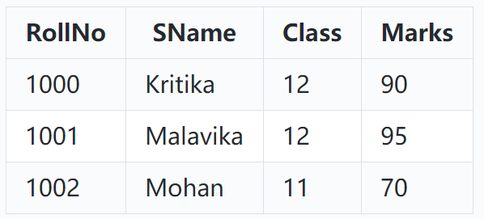

# Lab Record Programs

1. Write a program to create a dictionary containing names of competition winners as keys and the number of wins as values. [Code](https://github.com/GauthamVarmaK/CBSE-XI-XII-Record-Programs/blob/main/Class%20XII/01%20Python%20Dictionaries/main.py)
2. Write a function to swap two values. [Code](https://github.com/GauthamVarmaK/CBSE-XI-XII-Record-Programs/blob/main/Class%20XII/02%20Function%20to%20Swap%202%20Values/main.py)
3. Write a random number generator that generates random number between 1 and 6 (like a dice). [Code](https://github.com/GauthamVarmaK/CBSE-XI-XII-Record-Programs/blob/main/Class%20XII/03%20Random%20Number%20Generator/main.py)
4. Read a text file line by line and display each word separated by a #. [Code](https://github.com/GauthamVarmaK/CBSE-XI-XII-Record-Programs/blob/main/Class%20XII/04%20Words%20of%20file%20sperated/main.py)
5. Read a text file and display the number of vowels/consonants/uppercase/lowercase characters in the file. [Code](https://github.com/GauthamVarmaK/CBSE-XI-XII-Record-Programs/blob/main/Class%20XII/05%20Count%20of%20Character%20types%20in%20a%20file/main.py)
6. Create a binary file with name and roll number. Search for a given roll number and display the name, if not found display appropriate message. [Code](https://github.com/GauthamVarmaK/CBSE-XI-XII-Record-Programs/blob/main/Class%20XII/06%20Binary%20File%2001/main.py)
7. Create a binary file with roll number, name and marks. Input a roll number and update the marks. [Code](https://github.com/GauthamVarmaK/CBSE-XI-XII-Record-Programs/blob/main/Class%20XII/07%20Binary%20File%2002/main.py)
8. Remove all the lines that contain the character 'a' in a file and write it to another file. [Code](https://github.com/GauthamVarmaK/CBSE-XI-XII-Record-Programs/blob/main/Class%20XII/08%20Text%20File%2001/main.py)
9. Write a Python program to implement a stack using a list data-structure. [Code](https://github.com/GauthamVarmaK/CBSE-XI-XII-Record-Programs/blob/main/Class%20XII/09%20Stack%20using%20list/main.py)
10. Write a Python program to implement a queue using a list data-structure. [Code](https://github.com/GauthamVarmaK/CBSE-XI-XII-Record-Programs/blob/main/Class%20XII/10%20Queue%20using%20list/main.py)
11. Take a sample of ten phishing e-mails (or any text file) and find most commonly occurring word(s). [Code](https://github.com/GauthamVarmaK/CBSE-XI-XII-Record-Programs/blob/main/Class%20XII/11%20Most%20Occuring%20word%20in%20file/main.py)
12. The 'Student' table is stored in the database 'School' in MySQL. The database credentials include host as 'localhost', user as 'root' and password as '1234'. The Student Table has following data: Write Python codes to do the following:

    1. Import the required library to establish connection between MySQL and Python.
    2. Establish Connection with the database and instantiate a cursor.
    3. Display the details of students who belongs to class 12.
    4. Close the connection. [Code](https://github.com/GauthamVarmaK/CBSE-XI-XII-Record-Programs/blob/main/Class%20XII/12%20Python%20MySQL%20Connectivity%2001/main.py)
13. Program: Python-MySQL connectivity to retrieve all the data of table student. [Code](https://github.com/GauthamVarmaK/CBSE-XI-XII-Record-Programs/blob/main/Class%20XII/13%20Python%20MySQL%20Connectivity%2002/main.py)
14. Write a MYSQL-Python connectivity code to retrieve one record at a time from table EMPLOYEES who live in 'Delhi' [Code](https://github.com/GauthamVarmaK/CBSE-XI-XII-Record-Programs/blob/main/Class%20XII/14%20Retrieving%20record-by-record/main.py)
15. Write a program using MYSQL- Python to update employee record where new value of age is 60 where employee name must be start with A [Code](https://github.com/GauthamVarmaK/CBSE-XI-XII-Record-Programs/blob/main/Class%20XII/15%20Updating%20records/main.py)
16. Write a program using MYSQL- Python to insert a record in table doctor where columns are DID, Dname and Area. [Code](https://github.com/GauthamVarmaK/CBSE-XI-XII-Record-Programs/blob/main/Class%20XII/16%20Inserting%20records/main.py)
17. Define a function which will find all such numbers which are divisible by 7 but are not a multiple of 5, between 1000 and 3000 (both included) [Code](https://github.com/GauthamVarmaK/CBSE-XI-XII-Record-Programs/blob/main/Class%20XII/17%20Divisibility%20Function/main.py)
18. Define a function which can generate and print a list where the values are square of numbers between 1 and 20 (both included) [Code](https://github.com/GauthamVarmaK/CBSE-XI-XII-Record-Programs/blob/main/Class%20XII/18%20Square%20Function/main.py)
19. Define a function that accepts a sentence and calculate the number of upper-case letters and lower-case letters. [Code](https://github.com/GauthamVarmaK/CBSE-XI-XII-Record-Programs/blob/main/Class%20XII/19%20LowerUpper/main.py)
20. Write a python program to reverse a 3-digit number. [Code](https://github.com/GauthamVarmaK/CBSE-XI-XII-Record-Programs/blob/main/Class%20XII/20%20Reverse%203Digit%20Number/main.py)
21. Write a Python-MySQL connectivity program to create a table 'STUDENT\_MARKS' containing: Roll\_No, Name, Marks with an appropriate primary key. Insert 5 records, as per the user input. [Code](https://github.com/GauthamVarmaK/CBSE-XI-XII-Record-Programs/blob/main/Class%20XII/21%20Create%20new%20table%20and%20add%20records/main.py)
22. Write a python function to print all the prime numbers from 1 to 50. [Code](https://github.com/GauthamVarmaK/CBSE-XI-XII-Record-Programs/tree/main/Class%20XII/22%20Prime%20Numbers)
